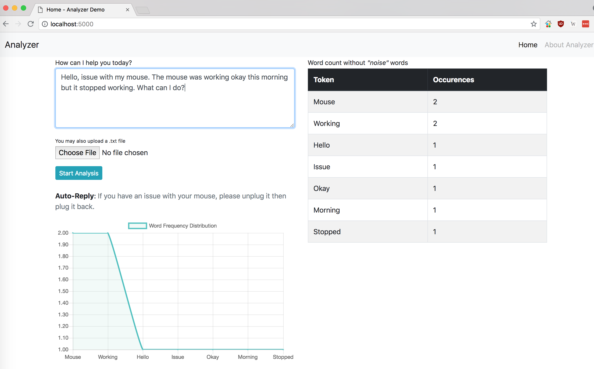
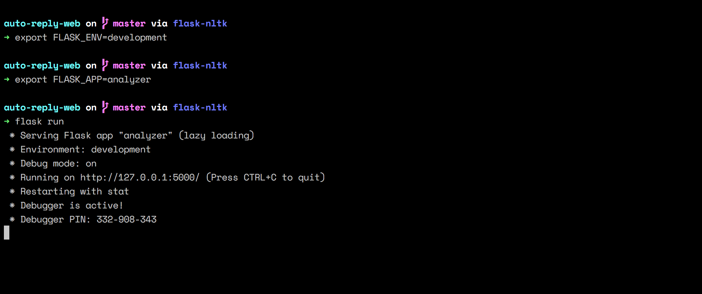

# Analyzer
Demo "auto-reply" app that uses [nltk](https://www.nltk.org/).



#### What should the app do?

- Process text
- Compute the count of each word
- Analyse its usage based on its count (percentage)
- Detect the keyword with the highest percentage from the analysis
- Search for the keyword in database
- Display answer related to keyword
- Filter out **noise words** like - *at, the, I, etc.*

#### Installation
The app requires [Python](https://www.python.org/) 3.6 or later. You will also need [git](https://git-scm.com/).

##### Mac/Unix
1. Clone this repository on your machine then `cd` into it
```
git clone https://github.com/clovisphere/auto-reply-web.git && cd auto-reply-web
```
The directory should look like:
```
├── MANIFEST.in
├── analyzer
│   ├── __init__.py
│   ├── db.py
│   ├── processor.py
│   ├── robot.py
│   ├── schema.sql
│   ├── static
│   │   └── Chart.min.js
│   ├── templates
│   │   ├── base.html
│   │   └── index.html
│   └── upload
├── instance
│   └── demo.db
├── requirements.txt
├── setup.py
└── test
```
2. Install [virtualenvwrapper](http://virtualenvwrapper.readthedocs.io/en/latest/install.html).
```
$ pip install virtualenvwrapper
```
(Python [3.6](https://www.python.org/downloads/) comes bundled with [pip](https://docs.python.org/3/installing/index.html), the python package installer.)

**IMPORTANT**: use `mkvirtualenv env` to create an **environment** named **env**, and `workon env` to switch or start working on/in that environment.

3. Install all the required app libraries 
```
(env)$ pip install -r requirements.txt
```
##### Run app
```
(env)$ export FLASK_ENV=development
(env)$ export FLASK_APP=analyzer
(env)$ flask run
```

If you did things right, and all went well, you should be able to access the app on [http://127.0.0.1:5000](http://127.0.0.1:5000/).



:smiley::wink: enjoy:zzz::ok_hand:

